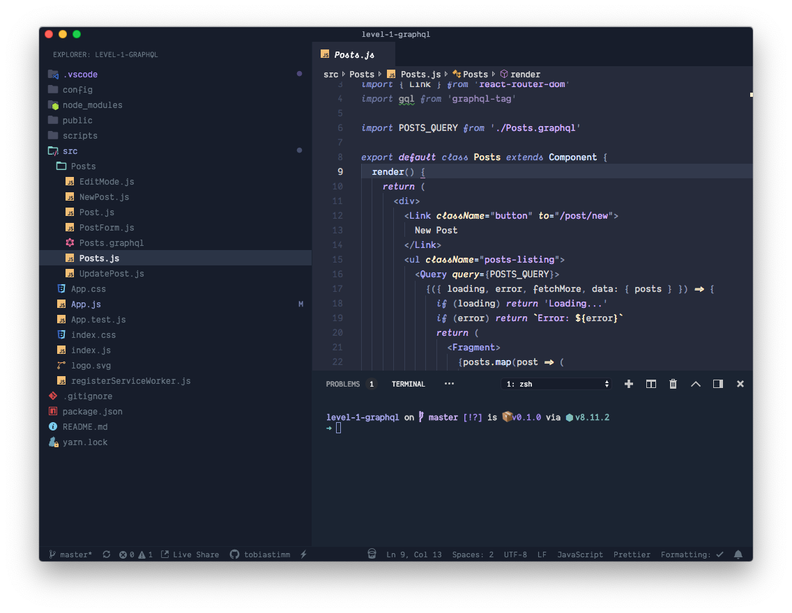

# Raijū

[**Raijū**](https://tobiastimm.github.io/raiju/) is a Visual Studio Code theme inspired by [Ariake Dark](https://marketplace.visualstudio.com/items?itemName=wart.ariake-dark) and [Subliminal](https://marketplace.visualstudio.com/items?itemName=gaearon.subliminal).

## Variants

**Raijū** comes with 2 variants per default.

### Classic

_Icon theme: [Material Theme Icons Ocean](https://marketplace.visualstudio.com/items?itemName=teabyii.ayu), Font: [Dank Mono](https://dank.sh)_

### Next (currently in Preview)

_Icon theme: [Material Theme Icons Ocean](https://marketplace.visualstudio.com/items?itemName=teabyii.ayu), Font: [Dank Mono](https://dank.sh)_

## Usage

Select the theme and you are ready to go!

## Installation

1.  Open Extensions sidebar panel in VS Code. View → Extensions
1.  Search for `Raijū`
1.  Click Install
1.  Click Reload
1.  File > Preferences > Color Theme > Raijū
1.  Optional: Use the settings below for a better and more minimalistic experience

## Supported Languages

The following languages & frameworks are supported by the `Classic` variant

- JavaScript
  - React
  - AngularJS
- TypeScript / Flow
- ReasonML
- Java
- C#
- JSON
- HTML
- CSS
  - SCSS
  - LESS
  - Stylus
- XML
- YML
- PHP
- Markdown

> Currently not all languages/frameworks are supported by the `next` theme.
>
> If one specific language / framework is missing, feel free to open a [Github issue](https://github.com/tobiastimm/raiju/issues)

## Feedback / Issues

Do you like the theme? Don't hesitate to share your thoughts!

Let me know, if you'd like to see any specific synytax added by creating a [Github issue](https://github.com/tobiastimm/raiju/issues).

## Author

[Tobias Timm](https://twitter.com/TbsTimm)

## Other themes

- [**SubliminalR**](https://tobiastimm.github.io/subliminalr/)
- [**Sceanic**](https://tobiastimm.github.io/sceanic/)
- [**Duotoned**](https://tobiastimm.github.io/duotoned/)

## License

MIT
