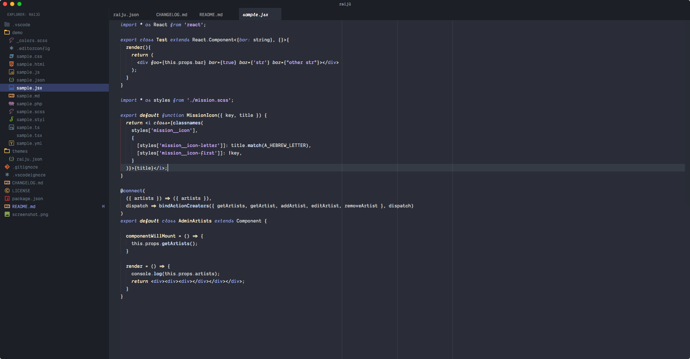

# Raijū

[](https://marketplace.visualstudio.com/items?itemName=TobiasTimm.raiju)
[](https://marketplace.visualstudio.com/items?itemName=TobiasTimm.raiju)

[**Raijū**](https://tobiastimm.github.io/raiju/) is a Visual Studio Code theme inspired by [Ariake Dark](https://marketplace.visualstudio.com/items?itemName=wart.ariake-dark) and [Subliminal](https://marketplace.visualstudio.com/items?itemName=gaearon.subliminal).

See the [CHANGELOG](CHANGELOG.md) for the latest changes.

> Subliminal was removed!. Please use [**SubliminalR**](https://marketplace.visualstudio.com/items?itemName=TobiasTimm.subliminalr) instead.



_Icon theme: [ayu](https://marketplace.visualstudio.com/items?itemName=teabyii.ayu), Font: [Dank Mono](https://dank.sh)_

## Usage

Select the theme and you are ready to go!

## Installation

1.  Open Extensions sidebar panel in VS Code. View → Extensions
1.  Search for `Raijū`
1.  Click Install
1.  Click Reload
1.  File > Preferences > Color Theme > Raijū
1.  Optional: Use the settings below for a better and more minimalistic experience

## Minimalistic Look & Feel

I personally prefer a more minimalistic look. My settings are

```js
{
    "editor.folding": false,
    "editor.hideCursorInOverviewRuler": true,
    "editor.lineNumbers": "off",
    "editor.matchBrackets": false,
    "editor.minimap.enabled": false,
    "editor.occurrencesHighlight": false,
    "editor.overviewRulerBorder": false,
    "editor.renderIndentGuides": false,
    "editor.renderLineHighlight": "none",
    "editor.scrollbar.horizontal": "hidden",
    "explorer.openEditors.visible": 0,
    "window.zoomLevel": 0,
    "workbench.activityBar.visible": false,
    "workbench.colorTheme": "Raijū",
    "workbench.iconTheme": "ayu",
    "workbench.editor.showIcons": false,
    "workbench.statusBar.visible": false,
    "workbench.editor.tabCloseButton": "off"
}
```

Since I have turned off features like the default matching brackets highlighting, I recommend you to install [Subtle Match Brackets](https://marketplace.visualstudio.com/items?itemName=rafamel.subtle-brackets).

To remove the icon buttons on panels you need to install [Custom CSS and JS Loader](https://marketplace.visualstudio.com/items?itemName=be5invis.vscode-custom-css) with the following custom CSS:

```css
.title-actions
  > .monaco-toolbar
  > .monaco-action-bar
  > .actions-container
  > .action-item
  > .action-label.icon.explorer-action {
  display: none !important;
}
.editor-actions > .monaco-toolbar > .monaco-action-bar {
  display: none !important;
}
```

You can remove the warning from the title bar with [this extension](https://marketplace.visualstudio.com/items?itemName=fabiospampinato.vscode-no-unsupported).

#### Custom font

To use a special font for the UI you need to add addtional custom css rules

```css
.monaco-shell {
  font-family: 'Dank Mono';
}

// For better readability
.monaco-workbench
  > .activitybar
  > .content
  .monaco-action-bar
  .badge
  .badge-content {
  top: 17px !important;
}
```

## Feedback / Issues

Do you like the theme? Don't hesitate to share your thoughts!

Let me know, if you'd like to see any specific synytax added by creating a [Github issue](https://github.com/tobiastimm/raiju/issues).

## Author

[Tobias Timm](https://twitter.com/TbsTimm)

## License

MIT
